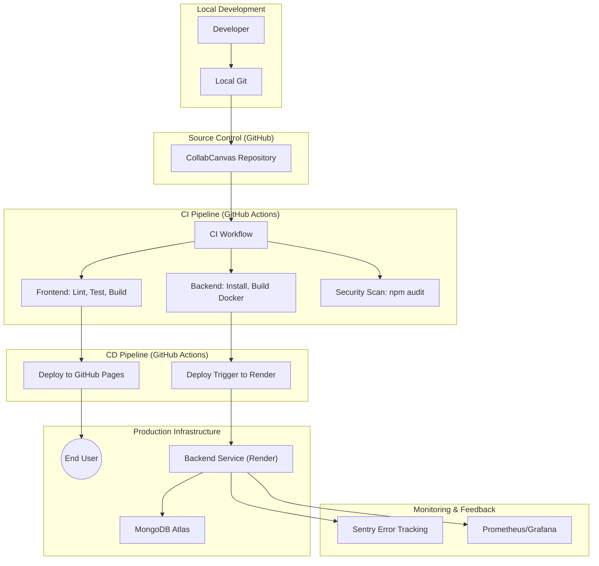

# DevOps Strategy - CollabCanvas

This document outlines the DevOps strategy for the CollabCanvas project, including the CI/CD pipeline, deployment architecture, and quality assurance checks.

## 1. System Architecture Diagram

## 2. Component Strategy

| Component | Source Code Repo | Deployment Location | Pre-deployment Checks | Tools & Libraries |
| :--- | :--- | :--- | :--- | :--- |
| **Frontend** | `/frontend` | GitHub Pages | Linting, Unit Tests, Production Build | React, Vite, ESLint, Jest/Vitest, GitHub Actions |
| **Backend** | `/backend` | Render | Unit Tests, Integration Tests, Docker Build | Node.js, Express, Docker, Supertest, GitHub Actions |
| **Database** | Config in `/backend/config` | MongoDB Atlas (Managed Service) | Schema Validation, Connectivity Tests | Mongoose, MongoDB Atlas |
| **Infrastructure** | Root `docker-compose.yml` | Container Orchestrator (Managed) | Docker Build Check, Config Linting | Docker, Docker Compose, GitHub Actions |

## 3. CI/CD Workflow Detail

### Continuous Integration (CI)
Triggered on every Pull Request and Push to `main`.
- **Frontend Checks**:
    - `npm run lint`: Ensures code style consistency.
    - `npm test`: Runs Vitest suite for component logic.
    - `npm run build`: Ensures the application compiles for production.
- **Backend Checks**:
    - `npm install`: Verifies dependency resolution (including native canvas libs).
    - `npm test`: (To be implemented) Unit and API integration tests.
    - `docker compose build`: Verifies containerization of services.
- **Security**:
    - `npm audit`: Checks for known vulnerabilities in dependencies.

### Continuous Deployment (CD)
Triggered on successful merge to `main`.
- **Frontend**: Automated deployment to GitHub Pages via `JamesIves/github-pages-deploy-action`.
- **Backend**: Automated deployment to Render Web Service.
    1. Render automatically detects push to `main` (or via Deploy Hook).
    2. Builds service from Dockerfile or Native Node environment.
    3. Deploys new version to production.

## 4. Environment Management
- **Development**: Local environment using `docker-compose up`.
- **Staging**: Parallel GitHub Pages environment for frontend; isolated staging cluster for backend.
- **Production**: High-availability managed containers with MongoDB Atlas.

## 5. Monitoring and Observability
- **Error Tracking**: Integration with **Sentry** for real-time frontend and backend error reporting.
- **Logs**: Centralized logging using **CloudWatch** (AWS) or **Logtail**.
- **Performance**: **Prometheus** and **Grafana** for monitoring system resources and Socket.io performance.
